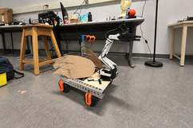
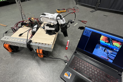
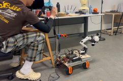
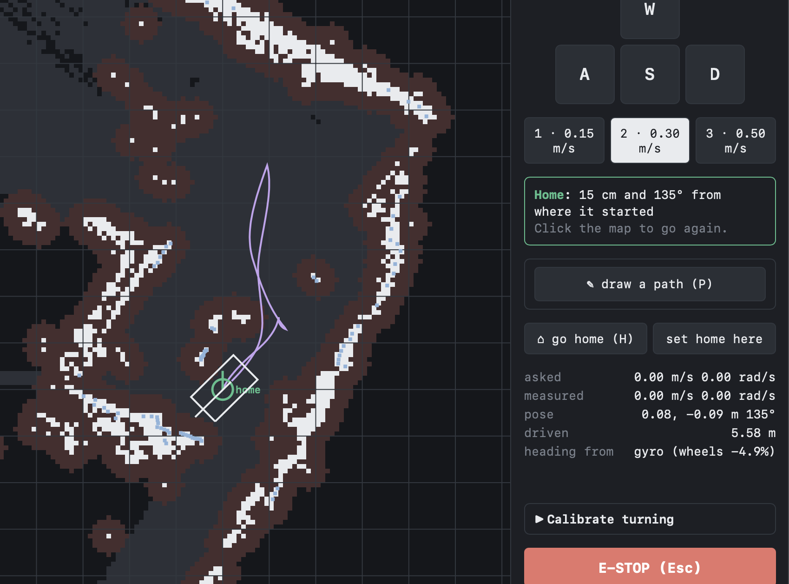
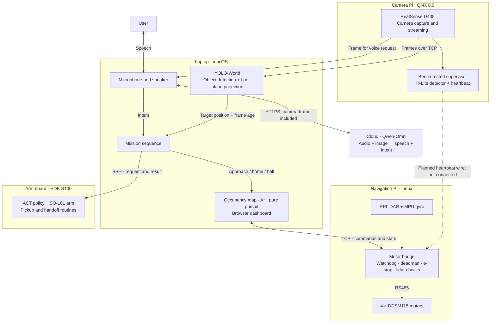
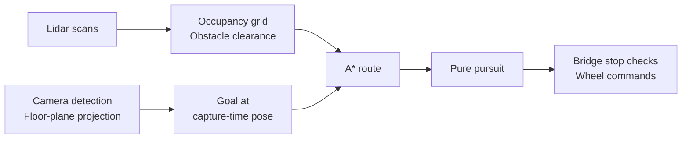
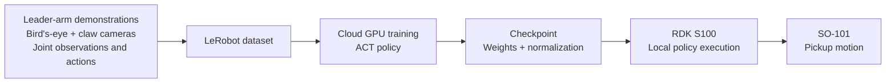

# Goosetriever

**An assistive robot for the things you drop.**

Multimodal voice interaction · autonomous navigation · learned manipulation

**🏆 Best use of Huawei's Real-Time Multimodal AI · Hack the North 2026**

[Watch the demo](https://youtu.be/G8Z7QbDx5YE) · [Devpost](https://devpost.com/software/robot-pickup-helper)

<a href="https://youtu.be/G8Z7QbDx5YE"></a>
<a href="https://youtu.be/G8Z7QbDx5YE"></a>
<a href="https://youtu.be/G8Z7QbDx5YE"></a>

*The physical prototype, camera setup, and testing at Hack the North.*

## Overview

A dropped object can interrupt someone's independence when bending down is difficult. Goosetriever explores a simple interaction: ask for the object, and a robot helps bring it within reach. Our first target was a goose plush.

The prototype brings together spoken requests, camera-based object detection, lidar mapping, autonomous driving, and an ACT grasping policy on a robotic arm. A browser dashboard exposes the map, motion, and controls throughout development.

> “Goosetriever, can you help me pick up my goose plushie?”

Voice-guided approaches, autonomous navigation, and individual arm capabilities were exercised on hardware. Reliable end-to-end pickup and return remains an integration milestone; later runs reached the goose but were blocked by a gripper-servo fault. [Project status](#project-status) distinguishes the running components from work tested separately.

## Contents

- [Project structure](#project-structure)
- [Demo and dashboard](#demo-and-dashboard)
- [System architecture](#system-architecture)
- [Multimodal AI](#multimodal-ai)
- [Mission control and object memory](#mission-control-and-object-memory)
- [Mapping and pathfinding](#mapping-and-pathfinding)
- [Motor control and state estimation](#motor-control-and-state-estimation)
- [ACT training and manipulation](#act-training-and-manipulation)
- [QNX camera and supervisor](#qnx-camera-and-supervisor)
- [Communication and stop behavior](#communication-and-stop-behavior)
- [Telemetry, replay, and deployment](#telemetry-replay-and-deployment)
- [Engineering decisions](#engineering-decisions)
- [Hardware](#hardware)
- [Project status](#project-status)
- [Roadmap](#roadmap)
- [Team and acknowledgments](#team-and-acknowledgments)
- [Quickstart](#quickstart)

## Project structure

```text
Goosetriever/
├── src/retriever/                 # Reusable Python runtime
│   ├── mission.py                # Approach → pickup → return → handoff
│   ├── memory.py                 # SQLite objects and timestamped sightings
│   ├── teleop.py                 # Dashboard server and navigation API
│   ├── teleop.html               # Map, camera view, telemetry, and controls
│   ├── navigation/
│   │   ├── grid.py               # Lidar occupancy grid and obstacle distances
│   │   ├── pathplan.py           # Costmap, A* search, and route smoothing
│   │   ├── pursuit.py            # Pure pursuit and speed control
│   │   └── navigator.py          # Mapping and autonomous navigation coordination
│   ├── perception/               # YOLO detection, floor projection, depth layers
│   ├── voice/                    # OMNI client and Mac/QNX/OpenAI voice adapters
│   ├── bridge/                   # Motor drivers, sensors, protocol, and stop checks
│   ├── planner/                  # Separate tool-calling language planner
│   ├── skills/                   # Robot skills exposed to that planner
│   └── backends/                 # Hardware interfaces and simulation backends
├── scripts/                      # Launchers for teleop, missions, voice, and cameras
├── hardware/
│   ├── nav_pi/                   # Navigation Pi setup and boot service
│   ├── qnx/                      # Camera capture and heartbeat supervisor
│   └── so101/
│       ├── ARM_BOARD.md          # Arm setup, calibration, and operating notes
│       └── scripts/
│           ├── record.sh         # Leader/follower demonstration recording
│           ├── fetch.py          # ACT inference and pickup execution
│           ├── arm_poses.py      # Saved poses and handoff motion
│           ├── hf/               # Hugging Face training jobs
│           └── baseten/          # Baseten training configuration
├── tools/
│   ├── deploy/                   # Deploy code to the navigation Pi
│   ├── diagnostics/              # Connection, wheel, and lidar checks
│   └── legacy/                   # Earlier setup experiments and hardware checks
├── tests/                        # Automated software and simulation tests
├── docs/
│   ├── assets/                   # Project photos and dashboard screenshot
│   ├── setup/                    # SSH setup instructions
│   ├── development.md            # Environments, launchers, and board dependencies
│   └── repository-layout.md      # Layout and renamed entry points
├── .github/workflows/tests.yml   # Python test workflow
├── .env.example                  # API configuration reference; no credentials
├── pyproject.toml                # Package metadata and optional dependencies
└── README.md
```

The distribution is named `goosetriever`; Python imports use `retriever`. The tree highlights the main entry points. See the [development guide](docs/development.md) for launch commands and the [migration guide](docs/repository-layout.md) for renamed paths.

## Demo and dashboard

**[Watch the project demo →](https://youtu.be/G8Z7QbDx5YE)**

The dashboard supports manual driving, click-to-go navigation, drawn paths, and return-to-home. It displays the occupancy map, robot pose, wheel commands, measured motion, and heading source.

<p align="center">
  
</p>

**Reading the map:** white cells mark mapped obstacles, brown shading shows the surrounding clearance region, the outlined footprint shows the estimated robot pose, and green marks home. The purple line is recorded movement history; planned routes are drawn separately. In this capture, the dashboard reports a return within 15 cm of home after 5.58 m of travel. These are the robot's estimates, not an independent accuracy measurement.

## System architecture

Four computers divide perception, navigation, and actuation. The diagram shows the final development setup. The QNX supervisor was tested on its board; its heartbeat connection to the drivetrain was not completed.



Cloud calls interpret the request. The laptop runs a fixed mission sequence and local navigation; the navigation Pi drives the motors. A separate tool-calling planner exists in the codebase but was not used in the hardware mission loop. The voice-to-mission connection was exercised through integration-session code; the checked-in voice and mission launchers currently run separately.

## Multimodal AI

A request such as “bring me that goose” needs both the spoken instruction and a view of the scene. The OMNI adapter sends the user's recorded utterance and the latest robot-camera image together, with a language prompt defining the robot's role. Qwen-Omni returns response text and generated speech through the sponsor-provided cloud API.

The software handles a voice turn in four stages:

1. **Capture:** record microphone audio and obtain a frame from the robot's camera stream. The Mac adapter converts the audio to mono WAV and the image to JPEG.
2. **Understand:** send audio, image, and instructions in one multimodal request. The client reads streamed text and audio from the response.
3. **Interpret:** parse the text into a small set of intents, including `fetch` with an object label and `stop`; play the spoken response through the speaker.
4. **Act:** the mission sequence uses the requested label to locate the object, request an approach, run the arm routine, and return home. Route planning and motor commands are computed locally.

The final integration sessions used the Mac's microphone and speaker, with camera frames from the QNX board. The checked-in voice and mission launchers remain separate; the single voice-to-mission entry point is still on the roadmap. Interaction is organized into recorded turns, and cloud latency affects response time.

An optional [OpenAI voice adapter](src/retriever/voice/openai.py) implements two alternatives: transcription → image-aware text response → speech synthesis, or an audio response supplied with a separately generated scene caption. These were developed after submission to explore latency and failure handling; they are separate from the sponsor OMNI path.

**Implementation:** [OMNI request and streaming client](src/retriever/voice/omni.py), [Mac audio adapter](src/retriever/voice/mac.py), [intent parsing](src/retriever/voice/qnx.py), and [mission sequencing](src/retriever/mission.py).

## Mission control and object memory

The hardware integration uses a fixed retrieval sequence. A request supplies an object label; the detector supplies a robot-relative position and frame age. The mission checks the observation, asks the navigation API to approach to a standoff distance, and waits for arrival. It then looks again and can make a bounded number of short corrections before invoking the arm over SSH. Pickup must report success before return-home begins, and arrival at home is checked before handoff.

The sequence rejects stale or non-finite detections and aborts on failed navigation. It also retains an experimental fallback: if the object disappears on the first arrival check, it lets the wrist-camera pickup routine try, on the assumption that the object moved beneath the main camera's view. That assumption needs further hardware validation.

A separate **tool-calling planner** exposes named skills for perception, navigation, manipulation, and asking the user a question. A skill registry validates arguments and returns structured results; the planner records tool outcomes and can pause for input without blocking inside a skill. This component is implemented and tested separately from the fixed sequence used in the hardware sessions.

The **SQLite memory layer** stores named objects, their embeddings, and timestamped sightings with position and confidence. It supports case-insensitive lookup and last-seen queries. Storing an embedding does not itself provide a working instance-recognition model; the live goose detector used class labels and floor geometry.

**Implementation:** [mission sequence](src/retriever/mission.py), [planner loop](src/retriever/planner/loop.py), [skill registry](src/retriever/skills/library.py), [built-in skills](src/retriever/skills/builtin.py), and [object memory](src/retriever/memory.py).

## Mapping and pathfinding

### Build a map from lidar and odometry

Each lidar scan is placed in a shared coordinate frame using the robot's estimated pose. Rays reduce the occupancy estimate of cells they pass through; returns increase it at the obstacle. The log-odds grid retains observations across scans, so the robot can plan around furniture it has already seen. The default mapping resolution is **5 cm per cell**.

Wheel feedback estimates travel, while the gyro improves heading during skid-steer turns. The map is anchored to this odometry, so accumulated pose error can distort it; the current mapper has no scan matching or loop closure.

### Find a route with A*

The planner converts the occupancy grid into a costmap, adding clearance around obstacles for the robot's footprint. Nearby obstacles and unexplored cells carry extra traversal costs. This encourages routes through open space while still allowing exploration when the goal lies beyond the scanned area.

**A*** searches an eight-connected grid at a default **10 cm planning resolution**. It ranks candidates by the route cost accumulated so far plus an estimate of the remaining distance to the goal. Diagonal moves cannot cut through blocked corners. After search, route smoothing removes unnecessary waypoints only when the shortcut remains traversable and passes the obstacle-clearance cost check. A clicked goal inside an obstacle can be shifted to a nearby free cell within a configured limit.

### Turn the route into motion

A **pure-pursuit controller** follows a point ahead on the route and computes the curve needed to reach it. The lookahead grows with speed; speed is limited by turn curvature, lateral acceleration, and distance to the destination. This turns a sequence of map cells into continuous forward and turning commands.

The navigation Pi applies separate drivetrain checks before driving the wheels: lidar clearance, a command watchdog, a deadman condition, and the e-stop. The planner supports conservative clearance for turns and tighter passage settings; the latter still depend on the live footprint checks to stop motion that does not fit.

### Turn an object detection into a goal

YOLO-World locates the requested object in the camera image. For the goose on the floor, the detector projects the bottom of its bounding box onto a floor plane using the camera mount and intrinsics. The observation includes its age so the approach controller can transform it using the robot's pose when the frame was captured. This depends on the object resting on the floor and on an accurately measured camera mount.

The running system used lidar for navigation obstacles. A separate depth-camera layer projects depth samples into the robot frame and marks elevated obstacles in the map. Its marks expire when they become stale, and lidar clearing does not erase them. It is implemented and tested but was not connected to that live path. The repository also retains an earlier **VFH-lite local avoidance controller** for the separate skill stack. It divides the surrounding scan into angular sectors, expands blocked sectors for the robot radius, and selects a free direction close to the goal with hysteresis to reduce steering oscillation. It reacts to the current scan; the dashboard instead uses the map-based route planner described above.



**Implementation:** [occupancy grid](src/retriever/navigation/grid.py), [A* and costmap](src/retriever/navigation/pathplan.py), [pure pursuit](src/retriever/navigation/pursuit.py), [floor-plane detection](src/retriever/perception/floor.py), and [drivetrain checks](src/retriever/bridge/safety.py).

## Motor control and state estimation

The four-wheel base is a **skid-steer platform**: it drives forward and rotates by commanding different speeds on the left and right sides. The kinematics convert requested forward speed `v` and yaw rate `ω` into wheel-side speeds:

```text
left  = v − ω × effective_track_width / 2
right = v + ω × effective_track_width / 2
```

Turning scrubs the tyres sideways, so the effective track width includes a measured **scrub factor**. The dashboard's turn-calibration routine compares wheel-estimated rotation with a known turn to calculate that correction. Commands requesting sideways motion are rejected because the chassis cannot execute them.

The navigation Pi's DDSM115 driver translates wheel speeds into commands on the shared **RS485 motor bus**, using frame validation and CRC checks. Feedback supplies wheel position and other motor telemetry. Mirrored motor directions are corrected in the driver; wheel checks help verify IDs, direction, and encoder scale before navigation.

**Odometry** unwraps encoder values across each revolution and integrates travel along an arc. Gyro heading improves turn estimates when wheel slip makes encoder-only rotation inaccurate. The MPU driver reads the IMU over I²C; a D435i raw-HID gyro driver is available as an alternative. Both use heading tracking that can relearn gyro bias during commanded standstill, reducing drift between movements.

Camera mount translation and rotation, wheel geometry, encoder scale, and gyro orientation all feed the same coordinate transforms. A wrong mount angle can therefore look like a mapping or pathfinding bug even when the planner is behaving correctly. These calibrations remain part of reproducing the physical robot.

**Implementation:** [kinematics](src/retriever/navigation/kinematics.py), [odometry](src/retriever/navigation/odometry.py), [motor driver](src/retriever/bridge/drivers.py), [MPU interface](src/retriever/bridge/mpu.py), and [gyro heading tracker](src/retriever/bridge/imu.py).

## ACT training and manipulation

Navigation brings the object within reach; a learned policy handles the arm's pickup motion. **Action Chunking with Transformers (ACT)** learns from demonstrations using camera observations and joint positions, and predicts a sequence of future joint actions. Predicting a chunk gives the policy a longer motion sequence to work with than choosing each action independently. The method comes from the [ACT / ALOHA research project](https://tonyzhaozh.github.io/aloha/).



**Demonstration collection.** The recording script uses an SO-101 leader/follower pair, a bird's-eye camera, and a claw camera to collect pickup episodes. It configures 640 × 480 video at 30 fps and 30-second episodes. Camera names, joint ordering, and calibration must remain consistent with the policy's inputs and outputs.

**Cloud training.** The repository includes Baseten configuration and a Hugging Face Jobs launcher; training moved to Hugging Face during development. The latter downloads a LeRobot dataset, trains an ACT policy, and periodically uploads checkpoints so an interrupted cloud job does not lose every saved model. Its normal configuration requests 100,000 training steps with batch size 64 and a checkpoint every 10,000 steps; a shorter smoke configuration checks the training pipeline.

**On-board execution.** The S100 loads the saved ACT weights and normalization processors, reads the arm's cameras and joint state, and sends predicted actions to the follower. Training runs in the cloud; pickup inference runs on the arm board. The board guide records CPU performance below the nominal 30 Hz target, so that target should not be treated as a measured execution rate.

**Pickup and handoff.** The learned pickup routine and the saved handoff pose are separate stages. Once the base returns home, the pose routine presents the object while preserving the gripper state. Later integrated attempts were blocked by gripper communication problems, so reliable end-to-end retrieval remains unfinished.

**Implementation:** [recording](hardware/so101/scripts/record.sh), [Hugging Face training](hardware/so101/scripts/hf/train_job.sh), [Baseten setup](hardware/so101/scripts/baseten/), [ACT execution](hardware/so101/scripts/fetch.py), and [arm operating guide](hardware/so101/ARM_BOARD.md).

## QNX camera and supervisor

The camera Pi runs **QNX 8.0**. Its `camtap` C program captures RealSense color and depth frames through the QNX Sensor Framework and publishes them in shared memory. A sequence counter marks a frame while it is being written, allowing readers to detect an incomplete copy. A board-local publisher forwards frames to the laptop; that publisher remains an external dependency of the recorded hardware setup.

The same board hosts a separate person-detection supervisor. A TFLite detector sends `SAFE` or `STOP` verdicts to **`lineguard`**, a C process with a high-priority `SCHED_FIFO` thread. The detector uses a person's bounding-box size as a proximity heuristic. `lineguard` accepts fresh verdicts through a local datagram socket and toggles a GPIO heartbeat only while conditions remain safe.

The heartbeat design makes a stopped process distinguishable from a healthy one: a frozen pin produces no new edges. Missing detector messages expire after 200 ms, and a safe interval is required before toggling resumes. The intended optocoupler connection isolates the two boards and lets the navigation Pi latch a stop when edges disappear.

**The supervisor was bench-tested; its physical heartbeat connection to the drivetrain was not completed.** The measured detector latency and failure response therefore describe the board experiment, not an end-to-end stopping guarantee for the robot.

**Implementation:** [camera capture](hardware/qnx/camtap.c), [person detector](hardware/qnx/detector.py), [heartbeat supervisor](hardware/qnx/lineguard.c), and [bench measurements](hardware/qnx/README.md).

## Communication and stop behavior

The system uses separate interfaces for navigation, cameras, and the arm:

| Link | Interface | What crosses it |
| --- | --- | --- |
| Browser / mission → laptop dashboard server | HTTP and server-sent events | Operator requests, navigation goals, and live state |
| Laptop ↔ navigation Pi | TCP, newline-delimited JSON; default port 7777 | Velocity requests, heartbeats, wheel state, and subscribed lidar data |
| Camera board → laptop | Frame stream; recorded setup used port 5577 | Camera images and metadata |
| Laptop → S100 | SSH | Pickup and pose commands, progress output, and exit status |
| QNX supervisor → navigation Pi | Planned GPIO heartbeat | Independent freshness signal; hardware connection unfinished |

The bridge protocol rejects malformed messages, unknown fields, non-finite numbers, and unsupported motion requests. Clients explicitly subscribe to extended telemetry, allowing the basic protocol to remain usable without lidar fields. The bridge core uses only Python's standard library; device-specific dependencies load when the corresponding drivers are enabled.

Several mechanisms handle different failures:

- **Connection watchdog:** the default 300 ms timeout stops the base when the controlling client goes silent.
- **Motion deadman:** the default 500 ms timeout expires an old motion command even if the client continues sending heartbeats.
- **Lidar checks:** the Pi checks the requested motion against recent scans and the swept footprint, reducing speed or stopping when clearance is insufficient or scan data becomes stale.
- **Latched e-stop:** an explicit stop survives reconnection. Clearing it requires a separate request; an enabled physical button must also be released.
- **Arm stop handling:** `fetch.py` handles stop signals between control iterations and preserves holding torque during cleanup. The other arm pose flows have different interruption constraints, documented in the arm guide.

These are prototype software controls. The arm is not connected to the drivetrain's stop chain, and an independent motor-power cutoff for a hung bridge remains unfinished.

**Implementation:** [wire protocol](src/retriever/bridge/protocol.py), [bridge state machine](src/retriever/bridge/server.py), [lidar checks](src/retriever/bridge/safety.py), [GPIO inputs](src/retriever/bridge/gpio.py), and [arm stop constraints](hardware/so101/ARM_BOARD.md#5-constraints-you-must-respect).

## Telemetry, replay, and deployment

The browser dashboard visualizes the occupancy grid, planned route, recorded motion trail, robot footprint, and home pose. It exposes manual driving, click-to-go navigation, drawn paths, turn calibration, camera viewing, and arm commands. The HTTP server streams state to the browser; camera video uses its own connection so a stalled image feed does not block dashboard state updates.

With recording enabled, the dashboard writes **JSON Lines logs** containing estimated poses, observed wheel state, lidar scans, planned routes, and requested motion. The replay tool presents recorded movement through the same bridge protocol as the robot. Where a recording lacks the original gyro heading, replay reconstructs wheel/heading inputs from the recorded pose; it reproduces the observed trajectory rather than serving as an independent sensor-accuracy measurement.

The navigation Pi also reports its **5 V supply rail and undervoltage flags** through its power-management interface. These readings help diagnose brownouts and disappearing peripherals. They do not measure the motor battery's remaining charge.

For deployment, the Pi setup script configures device access and a `systemd` service. The deployment tool checks connectivity, synchronizes the runtime and tooling, runs a hardware-free test subset on the Pi, and can start the bridge and measure link continuity. Local diagnostics cover motor direction, lidar, and network behavior. The S100 retains its separate pinned LeRobot environment and calibration; QNX programs build and run on their own board.

**Implementation:** [dashboard server](src/retriever/teleop.py), [replay tool](scripts/replay_drive.py), [power telemetry](src/retriever/bridge/power.py), [deployment tooling](tools/deploy/nav_pi.sh), and [development guide](docs/development.md).

## Engineering decisions

| Decision | Why it matters |
| --- | --- |
| **Separate language from motor control** | The voice model supplies an intent. Navigation code computes the route and wheel commands locally. |
| **Use the gyro for heading** | Skid-steer wheel slip made encoder-only turns inaccurate. Gyro fusion and stationary bias updates improved the heading estimate. |
| **Place observations at their capture-time pose** | The robot may move while a frame is transmitted and processed. A frame-age field lets navigation associate the target with an earlier pose. |
| **Inspect motion in the browser** | A map, movement trail, telemetry, and manual controls make sensor and control problems visible during integration. |
| **Test control logic without the robot** | Fake backends, simulated lidar, and injectable time support repeatable tests for planning and stop behavior. |
| **Use a heartbeat for the QNX supervisor** | A pin held at one level can outlive a crashed process. The prototype instead requires recurring edges; a steady level means the heartbeat has stopped. |

The QNX board guide records a **38.5 ms mean person-detector inference time** and a **225 ms detector-failure-to-heartbeat-stop** bench result. These measure the supervisor, not the assembled robot's stopping distance or total stopping time. See the [QNX measurements](hardware/qnx/README.md#measured-on-the-pi-5-qnxpi36-qnx-800-2026-09-19).

## Hardware

| Subsystem | Components | Role |
| --- | --- | --- |
| Mobile base | Four DDSM115 hub motors; RS485 adapter | Skid-steer driving and wheel feedback |
| Navigation board | Raspberry Pi 5; RPLIDAR A2M12; MPU-series IMU | Motor bridge, range sensing, gyro heading, and stop checks |
| Camera board | Raspberry Pi 5 running QNX 8.0; Intel RealSense D435i | Camera capture and supervisor experiments |
| Manipulation | RDK S100; SO-101 arm with Hiwonder HX-30HM servos; two arm cameras | Local ACT inference and handoff |
| Laptop | MacBook Pro | Voice I/O, object detection, mission sequencing, mapping, and dashboard |

The arm uses a pinned **Hiwonder fork of LeRobot**, board-specific patches, and a matching calibration. Its setup is not interchangeable with a stock SO-101 installation. Read the [arm integration guide](hardware/so101/ARM_BOARD.md) before reproducing the arm environment.

Board-specific entry points: [navigation Pi setup](hardware/nav_pi/setup.sh), [QNX guide](hardware/qnx/README.md), and [arm guide](hardware/so101/ARM_BOARD.md). These are development references; the complete hardware launch, camera publisher dependencies, and final integration adapters are not yet packaged into a fresh-clone workflow. Some board documentation describes earlier configurations.

## Project status

This is a hackathon research prototype. The table reflects the final recorded integration sessions, including work after submission, rather than treating every implemented component as part of one completed demo.

| Capability | Recorded status |
| --- | --- |
| Manual driving, click-to-go, paths, and return-home | Exercised on the physical base |
| Multimodal voice and visual target approach | Exercised together; latency varied and later runs reached the goose |
| ACT grasping and arm handoff | Arm routines developed and tested separately; later integrated pickup attempts blocked by an unresponsive gripper servo |
| QNX person-detection supervisor | Tested on the board; physical heartbeat connection to the drivetrain unfinished |
| Depth-camera obstacle layer | Implemented and tested; not fed into the live navigation path |
| Tool-calling planner | Implemented and tested; hardware missions used a fixed sequence |
| Complete voice-to-pickup-to-return workflow | Not yet reproducible as a reliable integrated run |

**Stop coverage:** the bridge's watchdog, deadman, and e-stop logic govern the drivetrain. The arm supports its own stop handling but is not connected to the same stop chain. Motor-power cutoff for a hung bridge also remains unfinished.

## Roadmap

- [ ] Restore reliable gripper communication and repeat the full retrieval sequence.
- [ ] Connect the voice and mission launchers and package the board-local camera dependencies for a reproducible hardware launch.
- [ ] Connect and validate the QNX heartbeat and coordinated arm stopping.
- [ ] Add a motor-power cutoff independent of the bridge process.
- [ ] Integrate camera obstacles and improve perception near the gripper.
- [ ] Train and evaluate grasping on more objects.
- [ ] Refine power distribution, chassis layout, and cable management.

## Team and acknowledgments

**Zachary Xie · Golgisoo Jafari · Jay Wen · Hao Yan**

Built for **Hack the North 2026**. Winner of the **Huawei OMNI Live Challenge** sponsor track.

The project uses Qwen-Omni through the sponsor-provided API, QNX and its on-device TFLite packages, and the LeRobot/ACT ecosystem with Hiwonder's arm integration. ACT training moved from Baseten to Hugging Face. An OpenAI-based voice alternative was also developed after submission.

**Development history.** Some software foundations were developed before the event and brought into this repository. Hardware integration and development continued during the hackathon and after submission. The repository captures that progression; it does not imply that every component was created or fully integrated during the competition window.

[Devpost](https://devpost.com/software/robot-pickup-helper) · [Demo video](https://youtu.be/G8Z7QbDx5YE)

## Quickstart

Run the navigation simulator on your laptop with **Python 3.10+**. It needs no robot or API key. NumPy is required for the map and route planner; the existing `camera` extra installs it.

```bash
git clone https://github.com/dark-sorceror/Goosetriever.git goosetriever
cd goosetriever

python3 -m venv .venv
source .venv/bin/activate
python -m pip install -e ".[camera]"

python scripts/teleop.py --sim
```

Open **http://127.0.0.1:8791** if the browser does not open automatically. On Windows PowerShell, activate the environment with `.venv\Scripts\Activate.ps1` instead.

| Control | Action |
| --- | --- |
| **W / A / S / D** | Drive manually |
| **Click the map** | Navigate to a destination |
| **Shift-click** | Request a round trip |
| **P** | Draw a path |
| **H** | Return home |
| **Space** | Halt |
| **Esc** | Latch the e-stop |

The simulator exercises the drivetrain, lidar, map, and navigation UI. It does not simulate a complete learned grasp or a live multimodal conversation.

To inspect the mission sequence without hardware, run:

```bash
python scripts/run_mission.py --dry-run --once "fetch the goose"
```

This prints the approach, pickup, return, and handoff sequence using simulated responses. For voice adapters, object detection, environment variables, and board deployment, see the [development guide](docs/development.md). These local examples do not require cloud credentials.

### Tests

With the environment above active:

```bash
python -m unittest discover -s tests -t .
```

The suite covers geometry, mapping, route following, protocol validation, watchdogs, voice request construction, mission sequencing, and arm stop handling. Fake motors, simulated lidar rooms, injectable clocks, and mocked cloud/SSH interfaces exercise failure paths without driving a robot or calling paid APIs. The CI workflow runs the Python suite on Python 3.10 and 3.12.

Software tests do not establish complete hardware reliability. The board guides separately record calibration requirements, bench measurements, and unresolved integration issues.
